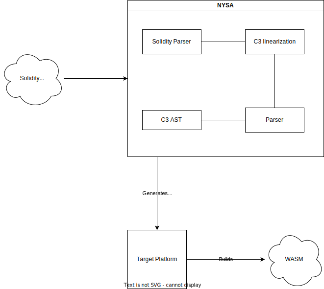

# NYSA

NYSA - Solidity to Rust Transpiler.

The project aims to transpile smart contracts written in Solidity to Rust smart contracts.

Nysa performs Solidity-to-Rust translation in four steps:




By design, Nysa is a universal tool, so the `Parser` component from the diagram is exchangeable. In other words, a Solidity input can be converted into Rust code supporting a framework/SDK of your choice, unless a parser implementation is provided.

At this moment, the only implementation is `OdraParser` which takes a contract written in Solidity and prints out [Odra](https://odra.dev/docs/)-compatible code.

## Prerequisites

- Rust toolchain installed (see [rustup.rs](https://rustup.rs/)).
- WebAssembly Binary Toolkit (wabt) installed (see [wabt](https://github.com/WebAssembly/wabt)).
- just (not required but recommended) (see [just](https://github.com/casey/just)).
- cargo-odra (not required but recommended) (see [cargo-odra](https://github.com/odradev/cargo-odra)).

## Test Nysa

To test `Nysa` internal tests, execute:

```bash
$ just test
```

The core of tests is the `resources` directory. It is a test collection of Solidity code samples with the expected Rust output. 

## Build and test examples

The easiest way to build and test examples is to run commands defined in the `justfile`.

To build wasm files and run tests, execute:

```bash
$ just test-status-contract-solidity
$ just test-token-contract-solidity
```

To run all the example tests, execute:

```bash
$ just test-examples
```
